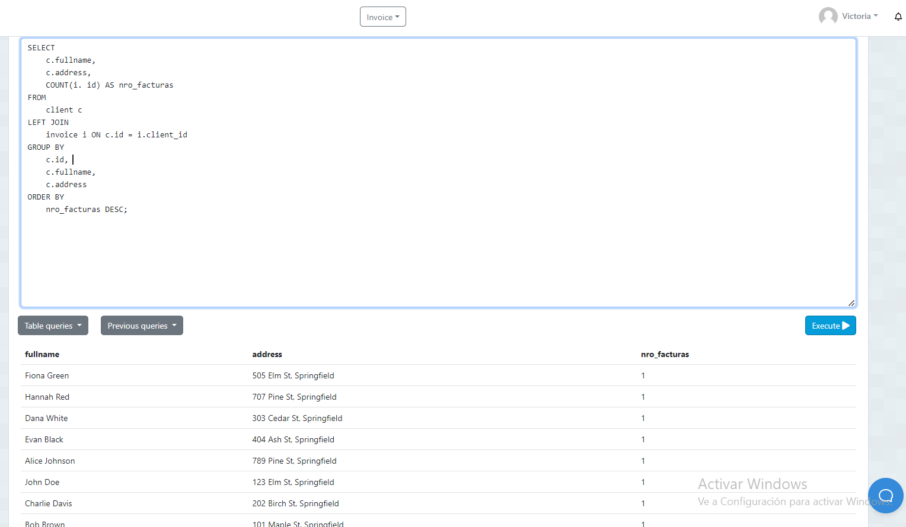
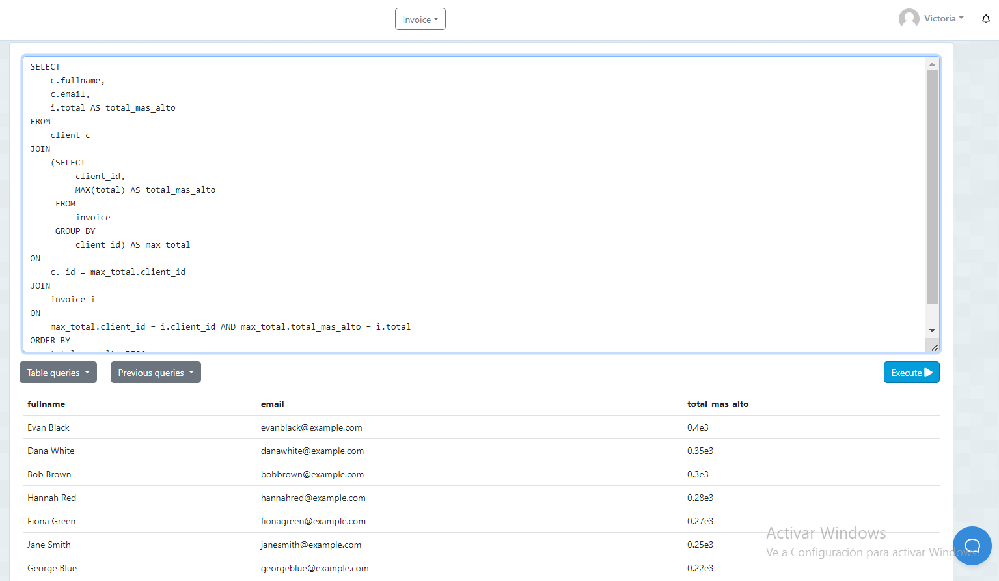
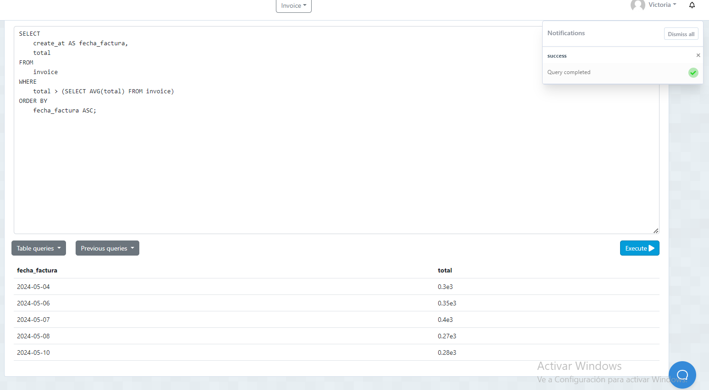
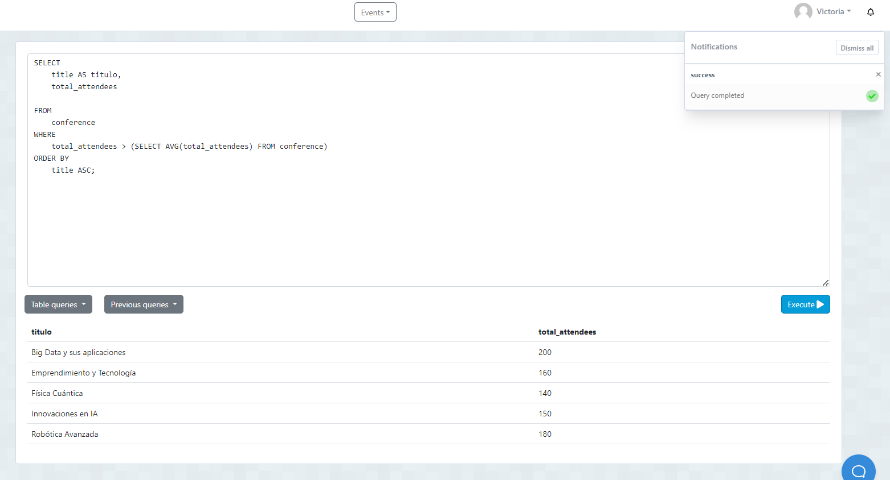

DB INVOICE

1. El numero total de facturas realizadas por cada cliente.
          nombre_cliente | direccion | nro_facturas

SENTENCIA:SELECT 
    c.fullname, 
    c.address, 
    COUNT(i. id) AS nro_facturas
FROM 
    client c
LEFT JOIN 
    invoice i ON c.id = i.client_id
GROUP BY 
    c.id, 
    c.fullname, 
    c.address
ORDER BY 
    nro_facturas DESC;

2. Listar nombre y correo de los clientes junto a su compra mas cara realizada.
          nombres |  correo   | total_mas_alto
SENTENCIA: 
SELECT 
    c.fullname, 
    c.email, 
    i.total AS total_mas_alto
FROM 
    client c
JOIN 
    (SELECT 
         client_id, 
         MAX(total) AS total_mas_alto
     FROM 
         invoice
     GROUP BY 
         client_id) AS max_total
ON 
    c. id = max_total.client_id
JOIN 
    invoice i
ON 
    max_total.client_id = i.client_id AND max_total.total_mas_alto = i.total
ORDER BY 
    total_mas_alto DESC;

    
3. Listar las facturas donde sus totales sean mayores al promedio de las facturas
          fecha_factura | total
SENTENCIA: 
SELECT 
    create_at AS fecha_factura, 
    total
FROM 
    invoice
WHERE 
    total > (SELECT AVG(total) FROM invoice)
ORDER BY 
    fecha_factura ASC;
    

SELECCIONAR DOS EJEMPLOS ADICIONALES 

SENTENCIA SELECT 
    title AS titulo, 
    total_attendees
    
FROM 
    conference 
WHERE 
    total_attendees > (SELECT AVG(total_attendees) FROM conference)
ORDER BY 
    title ASC;
 